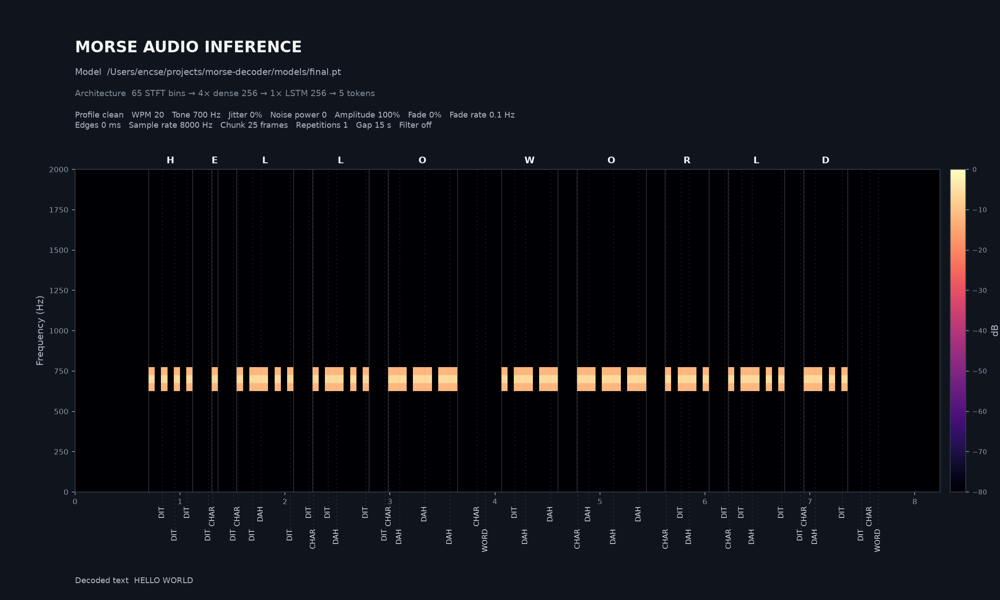
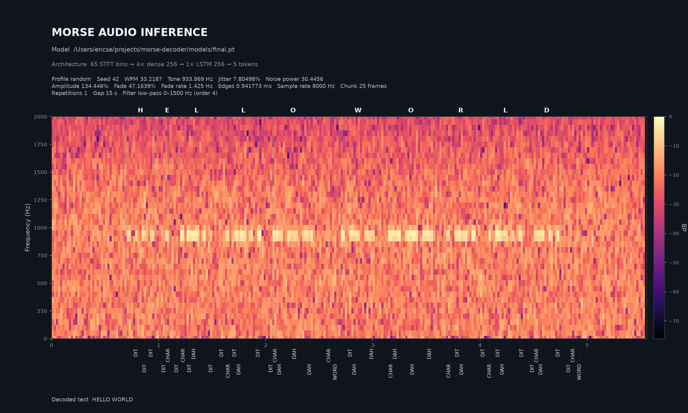
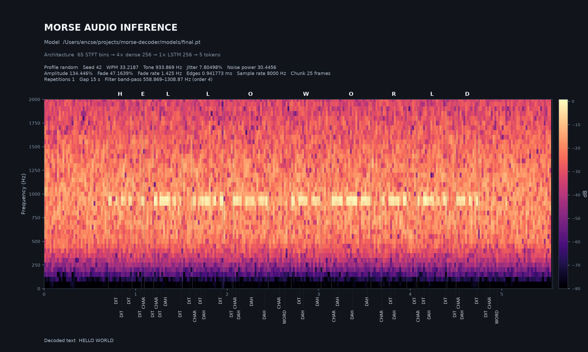

# Neural Morse Audio Decoder

This project trains a streaming LSTM to decode Morse audio into CTC tokens and
then deterministic text. The current workflow is a resumable adaptive
curriculum running locally or on a Kaggle GPU. The repository also contains
offline and live inference plus stateful ONNX export.

## Example analyses

### Clean signal

[Listen to the clean WAV](analysis/hello-world-clean.wav)



### 1500 Hz low-pass signal

[Listen to the low-pass WAV](analysis/hello-world-lowpass-1500hz.wav)



### 750 Hz-wide band-pass signal

[Listen to the band-pass WAV](analysis/hello-world-bandpass-750hz.wav)



Regenerate all three examples with `models/final.pt`. The two filtered
examples use the same random supported-range condition and background noise,
so only their explicit receiver filter differs:

```bash
python generate_analysis.py
```

## Pipeline

```text
text
  -> Morse timing and waveform synthesis at 8 kHz
  -> 20 ms, 65-bin linear-power STFT frames
  -> frequency convolution and dense frame projection
  -> stateful LSTM
  -> CTC logits
  -> DIT / DAH / character boundary / word boundary
  -> decoded text
```

Training samples independently vary speed, carrier frequency, timing jitter,
noise power, amplitude, fading, and keying edge duration. The effective ranges
are saved in every checkpoint. Every generated word boundary uses the standard
seven-unit gap with 50% probability; otherwise its duration is sampled uniformly
from 2–20 times that gap, without adding another output character.

### Input filters

Every generated input, including both Morse-bearing and noise-only samples,
gets one reproducibly sampled receiver-style filter after the signal, noise,
fading, and recording gain have been combined:

- 50% low-pass: logarithmically sampled cutoff from at least 100 Hz above
  the Morse tone up to 3500 Hz;
- 50% band-pass: logarithmically sampled 100–1000 Hz bandwidth centered on
  the Morse tone (clipped only near the spectrum boundaries);
- both use a randomly selected second- or fourth-order smooth
  Butterworth-style magnitude response and preserve the input RMS.

There are exactly two automatic exceptions. The first curriculum stage, which
creates a model from scratch, stays unfiltered even when that stage is resumed.
All later stages enable the filters. Synthesized analysis with `--profile
clean` is also unfiltered, while `--profile random` applies the same
receiver-filter sampling. The separate `--lowpass-cutoff-hz` and
`--bandpass-bandwidth-hz` analysis options can add an explicitly requested
filter after profile processing. Explicit low-pass cutoffs must also be at
least 100 Hz above the selected Morse tone, and explicit band-pass bandwidths
must be between 100 and 1000 Hz.

## Setup and tests

Python 3.11 or newer is required.

```bash
conda activate morse
python -m pip install -e ".[test]"
python -m pytest
```

The optional extras are:

```bash
python -m pip install -e ".[onnx]"          # ONNX export
python -m pip install -e ".[live]"          # microphone/radio input
python -m pip install -e ".[kaggle-upload]" # dataset upload
```

## Adaptive curriculum

The complete training configuration is in `curriculum-plan.json`. The first
stage creates the model from scratch using one exact starting value for every
dimension and does not apply receiver filtering. Later stages enable receiver
filtering and widen one randomly selected dimension by one step
until decoded-text accuracy reaches the configured threshold for the required
number of epochs. A failed dimension is set aside and another unfinished
dimension is selected reproducibly.

Every stage, including the first one, uses the same model architecture and the
same `CTC + tone activity` training loss. There is no separate base-model
training phase. Every word, including the final word in a sample, ends with an
`END_WORD` target. The batch decoder treats the final `END_WORD` as a
terminator instead of rendering a trailing space.

The optional top-level `reference_wav` path is decoded after every successfully
completed stage. Its predicted Morse sequence and decoded text are printed for
progress tracking only; they do not affect training, validation, or range
selection. Relative paths are resolved from the directory where the curriculum
command runs.

The configured center values and final limits are:

| Dimension | Initial value | Final range |
| --- | ---: | ---: |
| WPM | 25 | 10–40 |
| Frequency | 700 Hz | 100–2000 Hz |
| Timing jitter | 0% | 0–10% |
| Noise power | 0 | 0–200 |
| Amplitude | 100% | 10–150% |
| Fade depth | 0% | 0–60% |
| Fade frequency | 0.5 Hz | 0.1–2 Hz |
| Rise/fall time | 0 ms | 0–10 ms |

Training silence classes use disjoint hard timing bands so that one duration
never has two boundary labels:

| Silence class | Default range |
| --- | ---: |
| Within a character | 0.5–1.5 dit |
| Between characters | 2.0–4.5 dit |
| Between words | 5.5–9.0 dit, before extended-space multiplication |

Character gaps deliberately sample 60% of examples from the outer 0.3-dit
edges of their range, split evenly between short and long extremes. The
`--min-*-gap-units`, `--max-*-gap-units`,
`--character-gap-extreme-probability`, and
`--character-gap-extreme-width-units` training options can override these
defaults. Configuration validation rejects overlapping timing bands.

Run the plan locally:

```bash
python -m morse_timing.curriculum --plan curriculum-plan.json
```

The important model files are:

```text
models/morse-lstm-curriculum.pt
    latest successfully completed stage

models/morse-lstm-curriculum.working-stage-NNN*.pt
    current unfinished stage

models/morse-lstm-curriculum.curriculum.json
    adaptive stage, range, retry, and failed-dimension state

models/morse-lstm-curriculum.stages/stage-NNN.pt
    immutable archive of each completed stage
```

Rerunning the same plan resumes a matching working checkpoint with its
optimizer and scheduler. A newly selected range initializes from the stable
named checkpoint with a fresh optimizer.

## Kaggle training

The launcher requires a CUDA accelerator and uses the PyTorch installation in
the Kaggle image.

Start or resume the configured curriculum:

```python
%cd /kaggle/working/morse
!python kaggle_train.py
```

If the output directory already contains the named curriculum state, the
launcher resumes it. Use an empty output directory to start the curriculum
from its exact center values.

### Load the source bundle and models

Upload the current bundle as a new private Kaggle Dataset version:

```bash
conda activate morse
python upload_kaggle.py <yourname>/morsestuff \
    --archive morse.zip \
    --upload-model-dir models
```

Omit `--upload-model-dir` to build a source-only bundle. When provided, the
directory's immediate files are added under the archive's top-level `models/`
directory; subdirectories are ignored.

Use this as the first notebook cell. The current bundle contains `morse/` for
source and `models/` for checkpoints, so both are extracted directly below
`/kaggle/working`.

```python
import kagglehub
import os
import pathlib
import shutil
import zipfile

working_dir = pathlib.Path("/kaggle/working")
project_dir = working_dir / "morse"
models_dir = working_dir / "models"

dataset_dir = pathlib.Path(
    kagglehub.dataset_download(
        "<yourname>/morsestuff",
        force_download=True,
    )
)

if project_dir.exists():
    shutil.rmtree(project_dir)
if models_dir.exists():
    shutil.rmtree(models_dir)

archives = list(dataset_dir.rglob("morse.zip"))
if not archives:
    raise FileNotFoundError(f"No morse.zip under {dataset_dir}")

with zipfile.ZipFile(archives[0]) as archive:
    archive.extractall(working_dir)

if not (project_dir / "pyproject.toml").is_file():
    raise RuntimeError(f"Invalid project bundle: {project_dir}")
if not models_dir.is_dir():
    raise RuntimeError(f"Missing model directory: {models_dir}")

print("project:", project_dir)
for model_file in sorted(models_dir.rglob("*")):
    if model_file.is_file():
        print("model file:", model_file.relative_to(models_dir))

os.chdir(project_dir)
```

When the curriculum starts successfully, its log shows the exact source and
destination checkpoint:

```text
adaptive_training=...
resume=/kaggle/working/models/<working-checkpoint>.pt
output=/kaggle/working/models/<working-checkpoint>.pt
```

## Offline inference

Decode synthesized text with a saved checkpoint:

```bash
python -m morse_timing.audio_inference \
    models/morse-lstm-curriculum.pt \
    "HELLO WORLD"
```

Optional augmentation arguments such as `--wpm`, `--frequency`,
`--timing-jitter`, `--noise-power`, `--amplitude-percent`,
`--fade-depth-percent`, and `--rise-fall-ms` test a specific signal condition.

Generate a clean analysis:

```bash
python -m morse_timing.audio_inference \
    models/morse-lstm-curriculum.pt \
    "HELLO WORLD" \
    --profile clean
```

Choose one reproducible condition from the checkpoint's complete supported
WPM, frequency, jitter, noise, amplitude, fading, and rise/fall ranges:

```bash
python -m morse_timing.audio_inference \
    models/morse-lstm-curriculum.pt \
    "HELLO WORLD" \
    --profile random \
    --seed 42
```

Without `--seed`, the command creates and prints a new seed. Explicit signal
arguments override the corresponding value selected by the profile.

Set the exact analysis filename; the WAV is saved beside it with the same stem:

```bash
python -m morse_timing.audio_inference \
    models/morse-lstm-curriculum.pt \
    "HELLO WORLD" \
    --profile random \
    --seed 42 \
    --output audio/hello-world-random.png
```

The command saves both the generated WAV and a PNG analysis report under
`audio/`. The report shows the intended characters at the top of their exact
Morse audio spans. The model's time-aligned collapsed CTC token labels sit
below the time axis, with faint dashed guides crossing the spectrogram. Its
header records the model and signal parameters; the decoded text is printed
below the visualization.

Export exact trainer-generated inputs for visual inspection:

```bash
conda run -n morse python generate_training_samples.py \
    models/final.json \
    15 \
    --output-directory analysis/training-samples \
    --seed 42
```

Each sample is saved as a matching WAV/PNG/JSON triplet. Its JSON records the
generated text, word-gap multipliers, WPM, carrier frequency, noise, fading,
amplitude, and receiver filter. The exporter and the trainer share the same
dataset rendering path, so a given seed and sample index produce the same input.

Decode an external uncompressed PCM WAV file:

```bash
python -m morse_timing.audio_inference \
    models/morse-lstm-curriculum.pt \
    --wav audio/recording.wav
```

Stereo input is downmixed to mono and a different sample rate is resampled to
the checkpoint's expected rate.

Generate a WAV file without running inference:

```bash
python -m morse_timing.audio "HELLO WORLD" \
    --wpm 20 \
    --frequency 700 \
    --output audio/hello-world.wav
```

## Live inference

Install the `live` extra, list audio inputs, and select a microphone or radio
line input:

```bash
python -m morse_timing.live_inference --list-devices

python -m morse_timing.live_inference \
    models/morse-lstm-curriculum.pt \
    --input-device 2
```

The decoder retains LSTM and online CTC state between audio chunks. CPU is the
default for low-overhead real-time inference.

## ONNX export

Export the stateful LSTM:

```bash
python -m morse_timing.export_onnx \
    models/morse-lstm-curriculum.pt \
    --output models/morse-lstm-curriculum.onnx
```

The ONNX model accepts `features`, `hidden_state`, and `cell_state`, and returns
`logits`, `next_hidden_state`, and `next_cell_state`. Batch size and chunk
length are dynamic. Export metadata is written to
`models/morse-lstm-curriculum.onnx.json`.

## Source layout

```text
curriculum-plan.json         adaptive ranges and training configuration
kaggle_train.py              CUDA launcher and checkpoint restoration
upload_kaggle.py             private Kaggle Dataset uploader

src/morse_timing/
├── audio.py                 waveform synthesis and WAV writing
├── spectrogram.py           STFT features and visualization
├── morse.py                 deterministic Morse encoding
├── audio_tokens.py          CTC vocabulary and text decoding
├── audio_dataset.py         generated training examples and batching
├── audio_model.py           convolution, LSTM, and CTC model
├── audio_train.py           shared loss, metrics, and epoch helpers
├── train.py                 checkpointed CTC training
├── curriculum.py            adaptive plan execution
├── audio_inference.py       synthesized and WAV inference
├── live_inference.py        streaming audio inference
└── export_onnx.py           stateful ONNX export
```
