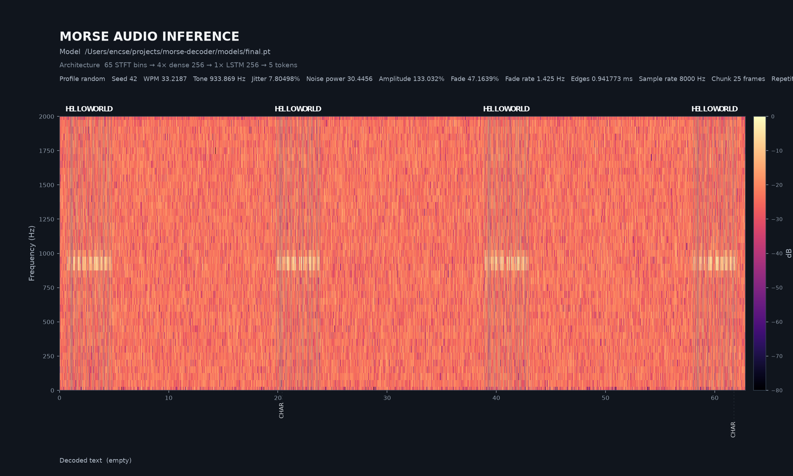

# Neural Morse Audio Decoder

This project trains a streaming LSTM to decode Morse audio into CTC tokens and
then deterministic text. The current workflow is a resumable adaptive
curriculum running locally or on a Kaggle GPU. The repository also contains
offline and live inference plus stateful ONNX export.

## Example analyses

### Clean signal

[Listen to the clean WAV](analysis/hello-world-clean.wav)


### Random supported-range signal

[Listen to the random WAV](analysis/hello-world-random.wav)



Regenerate both examples with `models/final.pt` and random seed `42`:

```bash
python generate_analysis.py
```

## Pipeline

```text
text
  -> Morse timing and waveform synthesis at 8 kHz
  -> 20 ms, 65-bin linear-power STFT frames
  -> four 384-unit dense frame projections
  -> two-layer, 384-unit stateful LSTM
  -> CTC logits
  -> DIT / DAH / character boundary / word boundary
  -> decoded text
```

The default LSTM has approximately 2.84 million parameters. It is
unidirectional so the same recurrent state can be reused for streaming
inference.

Training samples independently vary speed, carrier frequency, timing jitter,
noise power, amplitude, fading, and keying edge duration. The effective ranges
are saved in every checkpoint. Every generated word boundary is randomly
rendered as either the standard seven-unit gap or a doubled fourteen-unit gap,
without adding another output character. Noise-only samples with an empty CTC
target are supported but disabled by default with
`noise_only_probability = 0.0`.

## Setup and tests

Python 3.11 or newer is required.

```bash
conda activate morse
python -m pip install -e ".[test]"
python -m pytest
```

The optional extras are:

```bash
python -m pip install -e ".[onnx]"          # ONNX export
python -m pip install -e ".[live]"          # microphone/radio input
python -m pip install -e ".[kaggle-upload]" # dataset upload
```

## Adaptive curriculum

The complete training configuration is in `curriculum-plan.json`. The first
stage creates the model from scratch using one exact starting value for every
dimension. Later stages widen one randomly selected dimension by one step
until decoded-text accuracy reaches the configured threshold for the required
number of epochs. A failed dimension is set aside and another unfinished
dimension is selected reproducibly.

Every stage, including the first one, uses the same model architecture and the
same `CTC + 0.3 × tone activity + 0.3 × event timing` training loss. The
auxiliary head predicts whether each input frame overlaps a Morse tone and is
not used for inference. Timing targets place DIT/DAH at the first frame after a
tone, `END_CHARACTER` after one dit of confirmed silence, and `END_WORD` after
three dits of confirmed silence, including after the final word. To let the
model estimate the signal speed before exact event timing is enforced, the
timing loss applies only to the second half of samples containing at least ten
DIT/DAH events. The first half and shorter samples still train with CTC and
tone activity. Inside the supervised region, early, late, and repeated
emissions are penalized and each of the four event token classes contributes
equally. A doubled word gap does not delay either boundary target. The batch
decoder treats the final `END_WORD` as a terminator instead of rendering a
trailing space. There is no separate base-model training phase.

Training and validation logs report the unweighted `ctc_loss`,
`tone_activity_loss`, and `event_timing_loss` separately in addition to their
weighted total.

The optional top-level `reference_wav` path is decoded after every successfully
completed stage. Its predicted Morse sequence and decoded text are printed for
progress tracking only; they do not affect training, validation, or range
selection. Relative paths are resolved from the directory where the curriculum
command runs.

The configured center values and final limits are:

| Dimension | Initial value | Final range |
| --- | ---: | ---: |
| WPM | 25 | 10–40 |
| Frequency | 700 Hz | 100–2000 Hz |
| Timing jitter | 0% | 0–10% |
| Noise power | 0 | 0–200 |
| Amplitude | 100% | 10–150% |
| Fade depth | 0% | 0–60% |
| Fade frequency | 0.5 Hz | 0.1–2 Hz |
| Rise/fall time | 0 ms | 0–10 ms |

Run the plan locally:

```bash
python -m morse_timing.curriculum --plan curriculum-plan.json
```

The important model files are:

```text
models/morse-lstm-curriculum.pt
    latest successfully completed stage

models/morse-lstm-curriculum.working-stage-NNN*.pt
    current unfinished stage

models/morse-lstm-curriculum.curriculum.json
    adaptive stage, range, retry, and failed-dimension state

models/morse-lstm-curriculum.stages/stage-NNN.pt
    immutable archive of each completed stage
```

Rerunning the same plan resumes a matching working checkpoint with its
optimizer and scheduler. A newly selected range initializes from the stable
named checkpoint with a fresh optimizer.

## Kaggle training

The launcher requires a CUDA accelerator and uses the PyTorch installation in
the Kaggle image.

Start or resume the configured curriculum:

```python
%cd /kaggle/working/morse
!python kaggle_train.py
```

If the output directory already contains the named curriculum state, the
launcher resumes it. Use an empty output directory to start the curriculum
from its exact center values. By default the Kaggle launcher generates 5,000
training and 500 validation samples per dataset refresh. Override these with
`--train-samples` and `--validation-samples`. Direct local curriculum runs use
the values in `curriculum-plan.json`, currently 10,000 and 1,000.

### Load the source bundle

Upload the current bundle as a new private Kaggle Dataset version:

```bash
conda activate morse
python upload_kaggle.py <yourname>/morsestuff --archive morse.zip
```

The uploader first rebuilds `morse.zip` at the selected `--archive` path from
the current project sources, validates it, and only then uploads it. Models and
generated audio are excluded; `reference.wav` is included.

Use this as the first notebook cell. The uploaded archive extracts `morse/`
directly below `/kaggle/working`.

```python
import kagglehub
import os
import pathlib
import shutil
import zipfile

working_dir = pathlib.Path("/kaggle/working")
project_dir = working_dir / "morse"

dataset_dir = pathlib.Path(
    kagglehub.dataset_download(
        "<yourname>/morsestuff",
        force_download=True,
    )
)

if project_dir.exists():
    shutil.rmtree(project_dir)

archives = list(dataset_dir.rglob("morse.zip"))
if not archives:
    raise FileNotFoundError(f"No morse.zip under {dataset_dir}")

with zipfile.ZipFile(archives[0]) as archive:
    archive.extractall(working_dir)

if not (project_dir / "pyproject.toml").is_file():
    raise RuntimeError(f"Invalid project bundle: {project_dir}")

print("project:", project_dir)

os.chdir(project_dir)
```

When the curriculum starts successfully, its log shows the exact source and
destination checkpoint:

```text
adaptive_training=...
resume=/kaggle/working/models/<working-checkpoint>.pt
output=/kaggle/working/models/<working-checkpoint>.pt
```

## Offline inference

Decode synthesized text with a saved checkpoint:

```bash
python -m morse_timing.audio_inference \
    models/morse-lstm-curriculum.pt \
    "HELLO WORLD"
```

Optional augmentation arguments such as `--wpm`, `--frequency`,
`--timing-jitter`, `--noise-power`, `--amplitude-percent`,
`--fade-depth-percent`, and `--rise-fall-ms` test a specific signal condition.

Generate a clean analysis:

```bash
python -m morse_timing.audio_inference \
    models/morse-lstm-curriculum.pt \
    "HELLO WORLD" \
    --profile clean
```

Choose one reproducible condition from the checkpoint's complete supported
WPM, frequency, jitter, noise, amplitude, fading, and rise/fall ranges:

```bash
python -m morse_timing.audio_inference \
    models/morse-lstm-curriculum.pt \
    "HELLO WORLD" \
    --profile random \
    --seed 42
```

Without `--seed`, the command creates and prints a new seed. Explicit signal
arguments override the corresponding value selected by the profile.

Set the exact analysis filename; the WAV is saved beside it with the same stem:

```bash
python -m morse_timing.audio_inference \
    models/morse-lstm-curriculum.pt \
    "HELLO WORLD" \
    --profile random \
    --seed 42 \
    --output audio/hello-world-random.png
```

The command saves both the generated WAV and a PNG analysis report under
`audio/`. The report shows the intended characters at the top of their exact
Morse audio spans. The model's time-aligned collapsed CTC token labels sit
below the time axis, with faint dashed guides crossing the spectrogram. Its
header records the model and signal parameters; the decoded text is printed
below the visualization.

Decode an external uncompressed PCM WAV file:

```bash
python -m morse_timing.audio_inference \
    models/morse-lstm-curriculum.pt \
    --wav audio/recording.wav
```

Stereo input is downmixed to mono and a different sample rate is resampled to
the checkpoint's expected rate.

Generate a WAV file without running inference:

```bash
python -m morse_timing.audio "HELLO WORLD" \
    --wpm 20 \
    --frequency 700 \
    --output audio/hello-world.wav
```

## Live inference

Install the `live` extra, list audio inputs, and select a microphone or radio
line input:

```bash
python -m morse_timing.live_inference --list-devices

python -m morse_timing.live_inference \
    models/morse-lstm-curriculum.pt \
    --input-device 2
```

The decoder retains LSTM and online CTC state between audio chunks. CPU is the
default for low-overhead real-time inference.

## ONNX export

Export the stateful LSTM:

```bash
python -m morse_timing.export_onnx \
    models/morse-lstm-curriculum.pt \
    --output models/morse-lstm-curriculum.onnx
```

The ONNX model accepts `features`, `hidden_state`, and `cell_state`, and returns
`logits`, `next_hidden_state`, and `next_cell_state`. Batch size and chunk
length are dynamic. Export metadata is written to
`models/morse-lstm-curriculum.onnx.json`.

## Source layout

```text
curriculum-plan.json         adaptive ranges and training configuration
kaggle_train.py              CUDA launcher and checkpoint restoration
upload_kaggle.py             private Kaggle Dataset uploader

src/morse_timing/
├── audio.py                 waveform synthesis and WAV writing
├── spectrogram.py           STFT features and visualization
├── morse.py                 deterministic Morse encoding
├── audio_tokens.py          CTC vocabulary and text decoding
├── audio_dataset.py         generated training examples and batching
├── audio_model.py           convolution, LSTM, and CTC model
├── audio_train.py           shared loss, metrics, and epoch helpers
├── train.py                 checkpointed CTC training
├── curriculum.py            adaptive plan execution
├── audio_inference.py       synthesized and WAV inference
├── live_inference.py        streaming audio inference
└── export_onnx.py           stateful ONNX export
```
